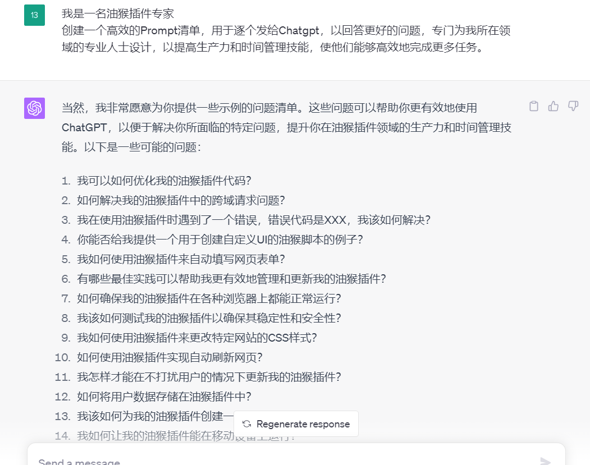
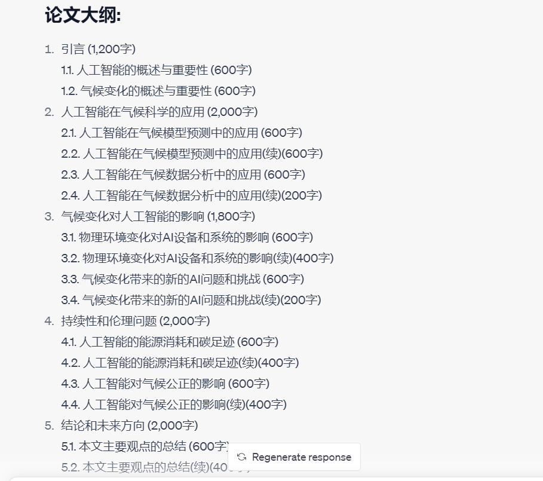

# Pre-ChatGPT

一款利用充分利用ChatGPT的插件

油猴直达链接:https://greasyfork.org/en/scripts/466781-pre-chatgpt

### 交流
 https://t.me/aitips66

### 插件的初衷

- 日常使用经常受到OpenAI官网3小时25次的限制，让我深感GPT4提问次数的宝贵，所以我就想利用空闲时间充分的利用GPT4

### 目前实现的功能

- 默认通过换行分隔提交prompt，并且可自定义分隔符号（适用长段文本分割）。
- 支持即时回答完毕后即可开始下一个提问（适合白天在电脑旁的时候使用），支持通过设定延时时间开始下一个提问（适合夜间睡觉或者不在电脑旁使用）。
    - 延时模式可在手机端使用（延时时间是发送前和发送后分别延时）
- 支持增强prompt（在问题文本后增加一定的prompt，提高回答问题的质量）。
- 本地存储设置信息和问题列表，并且有清空缓存的按钮，可以一键清空缓存
- 点击PreChatGPT即可进入设置页，再次点击即可保存并返回主页。
- 问题底部有统计栏，可以一键删除已回答问题，和一键删除未回答问题。

### 计划实现的功能

- [x]  完成回答逻辑优化
- [x]  点击继续回答按钮逻辑优化
- [x]  自定义问题分割
- [x]  批量增加结尾prompt
- [x]  延时模式
- [x]  增加一键删除已回答、未回答问题的按钮
- [x]  拖动排序功能
- [x]  提供常用增强prompt，如语气，逻辑，高质量prompt等等
- [ ]  快捷更新版本
- [ ]  UI界面优化
- [ ]  稳定性优化
- [ ]  增加不保存问题记录的设置
- [ ]  更多脑洞思维待开发，欢迎交流！

### 实用案列

- 快速了解一个行业
    
    Prompt：我是一名【工作名称】，创建一个高效的Prompt清单，用于逐个发给Chatgpt，以回答更好的问题，专门为我所在领域的专业人士设计，以提高生产力和时间管理技能，使他们能够高效地完成更多任务。
    
    
    
- 撰写论文
    
    Prompt：请你扮演院士，帮我拟写一个论文题目，并撰写一个结构清晰的大纲，并为每个大纲分配合适的字数，总字数要超过1w2
    如果字数大于600，请将大纲分为前后内容和逻辑均承接的两段
    例如：1.1 xxx（1100字），则要拆分为多个600字
    1.1 xxx（内容600字，第一段）
    1.1 xxx（内容500字第二段）
    
    

### 我的日常使用

配合KeepChatGPT和ChatGPT开启不限次数的GPT4-Mobile使用
https://greasyfork.org/en/scripts/467317-chatgpt%E5%BC%80%E5%90%AF%E4%B8%8D%E9%99%90%E6%AC%A1%E6%95%B0%E7%9A%84gpt4-mobile
即时模式配合GPT4-Mobile，生产力的永动机！！！
